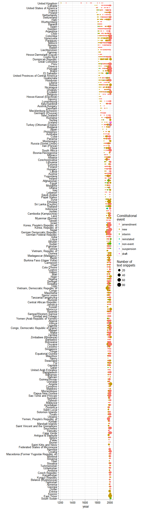
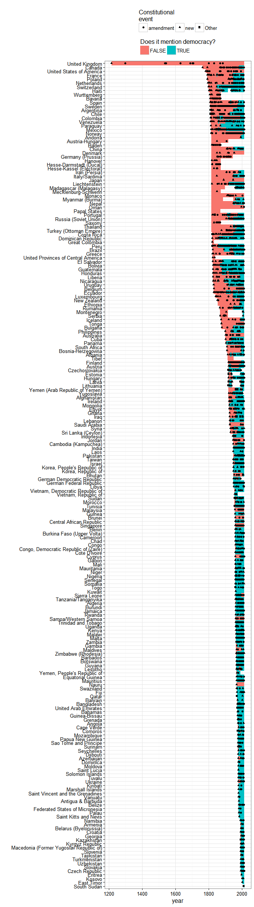

# Clean Up and Test Democracy Mentions Data
Xavier Marquez  
`r Sys.Date()`  


## Raw data description

The raw data consists of all the mentions of democracy in constitutional documents I was able to extract from the texts gathered by the Comparative Constitutions Project as of 2015. 

### Loading and cleanup


```r
library(tidyverse)
library(stringr)
library(knitr)

democracy_mentions <- read_csv("../../../../Data/Democracy mentions/democracy.mentions.csv",
                               col_types = cols(YEAR = col_number(),
                                                earliest.dem = col_number(),
                                                first.constitution.in.force = col_number())) %>%
  select(COUNTRY, YEAR, Name, EVENTTYPE, mentions) 

# Some years have a decimal, which we eliminate
democracy_mentions$YEAR <- as.integer(democracy_mentions$YEAR) 

# This is what the mentions look like

democracy_mentions %>%
  select(COUNTRY,YEAR,Name,mentions) %>%
  filter(!is.na(YEAR)) %>%
  head() %>%
  kable()
```


COUNTRY        YEAR  Name                                                              mentions                                                                                                                                                                                                                                                                                                                                                                                                                                                                                                                                                                                                                                                                                                                                                                                                                                                                                                                                                                                                                                                                                                                     
------------  -----  ----------------------------------------------------------------  -----------------------------------------------------------------------------------------------------------------------------------------------------------------------------------------------------------------------------------------------------------------------------------------------------------------------------------------------------------------------------------------------------------------------------------------------------------------------------------------------------------------------------------------------------------------------------------------------------------------------------------------------------------------------------------------------------------------------------------------------------------------------------------------------------------------------------------------------------------------------------------------------------------------------------------------------------------------------------------------------------------------------------------------------------------------------------------------------------------------------------
Afghanistan    1923  Afghanistan's Constitution of 1923                                NA                                                                                                                                                                                                                                                                                                                                                                                                                                                                                                                                                                                                                                                                                                                                                                                                                                                                                                                                                                                                                                                                                                                           
Afghanistan    1925  Afghanistan's Constitution of 1923 with Amendments through 1925   NA                                                                                                                                                                                                                                                                                                                                                                                                                                                                                                                                                                                                                                                                                                                                                                                                                                                                                                                                                                                                                                                                                                                           
Afghanistan    1931  Afghanistan's Constitution of 1931                                NA                                                                                                                                                                                                                                                                                                                                                                                                                                                                                                                                                                                                                                                                                                                                                                                                                                                                                                                                                                                                                                                                                                                           
Afghanistan    1933  Afghanistan's Constitution of 1931 with Amendments through 1933   NA                                                                                                                                                                                                                                                                                                                                                                                                                                                                                                                                                                                                                                                                                                                                                                                                                                                                                                                                                                                                                                                                                                                           
Afghanistan    1964  Afghanistan's Constitution of 1964                                In the Name of God, the Almighty and the Just.    To re-organize the national life of Afghanistan according to the requirements of the time and on the basis of the realities  of national history and culture;    To achieve justice and equality;    To establish political, economic and social democracy;    To organize the functions of the state and its branches to  ensure liberty and welfare of the individual and the maintenance of the general order;    To achieve a balanced development of all phases of life in  Afghanistan; and    To form, ultimately, a prosperous and progressive society based on social co-operation and preservation of human  dignity;    We, the people of Afghanistan, conscious of the historical  changes which have occurred in our life as a nation and as a  part of human society, while considering the above-mentioned  values to be the right of all human societies, have, under the leadership of His Majesty Mohammed Zahir Shah, the King of  Afghanistan and the leader of its national life, framed this constitution for ourselves and the generations to come. 
Afghanistan    1964  Afghanistan's Constitution of 1964                                In the name of God, the Almighty and the Just to reorganize the national life of Afghanistan according to the requirements of the times and on the basis of the realities of national history and culture; to achieve justice and equality; to establish political, economic and social democracy; to organize the functions of the state and its branches to ensure liberty and welfare of the individual and the maintenance of the general order; to achieve a balanced development of all phases of life in Afghanistan; and to form, ultimately, a prosperous and progressive society based on social cooperation and preservation of human dignity; we, the people of Afghanistan, conscious of the historical changes which have occurred in our life as a nation and as a part of human society, while considering the above mentioned values to be the right of all human societies, have, under the leadership of his majesty Mohammed Zahir Shah, the king of Afghanistan and the leader of its national life, framed this constitution for ourselves and the generations to come.                                

Once the data is loaded, we need to standardize the country names and make sure they correspond to the right country-names in the standard "international system":


```r
library(lubridate)

countries <- democracy_mentions %>% 
  distinct(COUNTRY, YEAR) %>%
  PoliticalDatasets::to_gw_system(country_col = "COUNTRY",
                                  date_col = "YEAR",
                                  match_condition = c("!(COUNTRY == 'Vietnam (Annam/Cochin China/Tonkin)' & country_name =='China' )",
                                              "!(COUNTRY == 'Yugoslavia (Serbia)' & country_name =='Yugoslavia' & (YEAR < 1900 | YEAR == 2006))",
                                              "(match_score == max(match_score))"))
```

```
## [1] "The following countries were not matched:"
## # A tibble: 14 × 3
##                                                                        COUNTRY
##                                                                          <chr>
## 1                                 African Charter on Human and People's Rights
## 2                                          American Convention on Human Rights
## 3                                                   Convention Against Torture
## 4   Convention on the Elimination of All Forms of Discrimination against Women
## 5                        Convention on the Rights of Persons with Disabilities
## 6                                        Convention on the Rights of the Child
## 7                                                               European Union
## 8                   French Declaration of the Rights of Man and of the Citizen
## 9  International Convention on the Elimination of All Forms of Racial Discrimi
## 10                        International Covenant on Civil and Political Rights
## 11             International Covenant on Economic, Social, and Cultural rights
## 12                                                                    Scotland
## 13                                         Vietnam (Annam/Cochin China/Tonkin)
## 14                                                                        <NA>
## # ... with 2 more variables: min <int>, max <int>
```

The country names for some documents not matched, simply because the documents do not refer to independent countries, or the document does not contain a proper country name: 


```r
anti_join(democracy_mentions,countries) %>% 
  group_by(COUNTRY, Name) %>% 
  summarise(min(YEAR),max(YEAR),n()) %>%
  knitr::kable()
```


COUNTRY                                                                             Name                                                                                 min(YEAR)   max(YEAR)   n()
----------------------------------------------------------------------------------  ----------------------------------------------------------------------------------  ----------  ----------  ----
African Charter on Human and People's Rights                                        African Charter on Human and People's Rights 1981                                         1981        1981     1
American Convention on Human Rights                                                 American Convention on Human Rights_1969                                                  1969        1969     6
Convention Against Torture                                                          Convention Against Torture                                                                  NA          NA     1
Convention on the Elimination of All Forms of Discrimination against Women          Convention on the Elimination of All Forms of Discrimination against Women                  NA          NA     1
Convention on the Rights of Persons with Disabilities                               Convention on the Rights of Persons with Disabilities                                       NA          NA     1
Convention on the Rights of the Child                                               Convention on the Rights of the Child                                                       NA          NA     1
European Union                                                                      European Union's Constitution of 2004                                                     2004        2004    26
French Declaration of the Rights of Man and of the Citizen                          French Declaration of the Rights of Man and of the Citizen 1789                           1789        1789     1
International Convention on the Elimination of All Forms of Racial Discrimination   International Convention on the Elimination of All Forms of Racial Discrimination           NA          NA     1
International Covenant on Civil and Political Rights                                International Covenant on Civil and Political Rights 1966                                 1966        1966     3
International Covenant on Economic, Social, and Cultural rights                     International Covenant on Economic, Social, and Cultural Rights                             NA          NA     2
Scotland                                                                            Scotland's Draft Constitution of 2014                                                     2014        2014     4
Vietnam (Annam/Cochin China/Tonkin)                                                 Vietnam (Annam/Cochin China/Tonkin)'s Constitution of 1946                                1946        1946     1
NA                                                                                  European Convention of Human Rights                                                         NA          NA     9
NA                                                                                  Universal Declaration of Human Rights 1948                                                  NA          NA     1

We also need to clean up column names, trim whitespace, and eliminate duplicates:


```r
democracy_mentions <- countries %>%
  left_join(democracy_mentions) %>% 
  rename(year = YEAR, constitutional.event = EVENTTYPE, ccp_country = COUNTRY) %>% 
  mutate(Name = str_trim(Name), 
         Name = str_replace(Name,"\\.[0-9]$",""),
         constitutional.event = factor(constitutional.event)) %>%
  select(country_name, 
         GWn, 
         year,
         Name,
         constitutional.event,
         mentions,
         ccp_country,
         GWc:in_system) 

# We eliminate duplicates

nrow(democracy_mentions)
```

```
## [1] 11219
```

```r
democracy_mentions <- distinct(democracy_mentions)

nrow(democracy_mentions)
```

```
## [1] 10959
```

These countries had their names changed:


```r
democracy_mentions %>% 
  filter(country_name != ccp_country) %>% 
  group_by(country_name, ccp_country) %>%
  summarise(min(year), max(year), n()) %>%
  knitr::kable()
```


country_name                              ccp_country                                min(year)   max(year)   n()
----------------------------------------  ----------------------------------------  ----------  ----------  ----
Antigua & Barbuda                         Antigua And Barbuda                             1981        1981    18
Congo, Democratic Republic of (Zaire)     Congo, Democratic Republic Of (Zaire)           1964        2011   166
Federated States of Micronesia            Micronesia, Fed. Sts.                           1990        1990     1
Korea, People's Republic of               North Korea                                     1948        2009   170
Korea, Republic of                        South Korea                                     1948        1987    24
Macedonia (Former Yugoslav Republic of)   Macedonia (Former Yugoslav Republic Of)         1991        2011    36
Papal States                              Vatican City                                    1929        2000     2
Rumania                                   Romania                                         1866        2003    81
Saint Kitts and Nevis                     St. Kitts And Nevis                             1983        1983    11
Saint Lucia                               St. Lucia                                       1978        1978     7
Saint Vincent and the Grenadines          St. Vincent And The Grenadines                  1979        1979     7
Samoa/Western Samoa                       Samoa                                           1962        2010    12
Sao Tome and Principe                     Sao Tome And Principe                           1975        2003    94
Serbia                                    Yugoslavia (Serbia)                             1869        2006    23
Trinidad and Tobago                       Trinidad And Tobago                             1962        2007    34
Turkey (Ottoman Empire)                   Turkey/Ottoman Empire                           1876        2011   172
United Provinces of Central America       United Provinces Of Central America             1824        1835     2
United States of America                  United States Of America                        1781        1992    18
Vietnam, Democratic Republic of           Vietnam, Democratic Republic Of                 1960        2001   105
Vietnam, Republic of                      Vietnam, Republic Of                            1956        1967     8
Yemen (Arab Republic of Yemen)            Yemen (Arab Republic Of Yemen)                  1962        2001    14
Yemen, People's Republic of               People's Republic of Yemen                      1978        1978    53
Yugoslavia                                Yugoslavia (Serbia)                             1921        2003   136

And here's what the data looks like, per country:


```r
library(forcats)

ggplot(data = democracy_mentions) +
  geom_count(aes(x=fct_rev(reorder(country_name,year,FUN = min)), y = year, color = fct_infreq(constitutional.event))) +
  coord_flip() +
  labs(x = "", color = "Constitutional\nevent", size = "Number of \ntext snippets") +
  theme_bw() 
```

<!-- -->

These are the countries where the first mention is not "new" or "interim" constitution:


```r
democracy_mentions %>% 
  group_by(country_name) %>%
  filter(!(first(constitutional.event) %in% c("new","interim"))) %>% 
  summarise(year = first(year), Name = first(Name), constitutional.event = first(constitutional.event)) %>%
  knitr::kable()
```


country_name                      year  Name                                                                              constitutional.event 
-------------------------------  -----  --------------------------------------------------------------------------------  ---------------------
Brunei                            1983  1983 Amendment to Brunei's Constitution of 1959                                   amendment            
Central African Republic          1962  Central African Republic's Constitution of 1959 with Amendments through 1962      amendment            
China                             1908  China_1908                                                                        non-event            
Federated States of Micronesia    1990  Micronesia, Fed. Sts.'s Constitution of 1981 with Amendments through 1990         amendment            
Israel                            1948  Israel's Constitution of 1948                                                     non-event            
Malaysia                          1977  Malaysia's Constitution of 1957 with Amendments through 1977                      amendment            
Maldives                          1975  Maldives's Constitution of 1968 with Amendments through 1975                      amendment            
Moldova                           1991  1991 Amendment to Moldova's Constitution of 1978                                  amendment            
Singapore                         1966  Singapore's Constitution of 1959 with Amendments through 1966                     amendment            
Tonga                             1967  Tonga's Constitution of 1875 with Amendments through 1967                         amendment            
Uganda                            1963  Uganda's Constitution of 1962 with Amendments through 1963                        amendment            
Yemen, People's Republic of       1978  Yemen, People'S Republic Of's Constitution of 1970 with Amendments through 1978   amendment            

These countries need to be fixed:


```r
fixed_countries <- democracy_mentions %>% 
  group_by(country_name) %>%
  filter(!(first(constitutional.event) %in% c("new","interim"))) %>% 
  summarise_all(funs(first(.))) %>%
  mutate(year = c(1959, 1959, 1908, 1981, 1948, 1957, 
                  1968, 1978, 1959, 1875, 1962, 1970),
         constitutional.event = c("new","new","new","new","new","new",
                                  "new","new","new","new","new","new"))

democracy_mentions <- bind_rows(democracy_mentions, fixed_countries) %>%
  arrange(country_name, year, Name) %>%
  mutate(has_mention = !is.na(mentions))
```

These constitutions have the wrong names or the wrong events:


```r
democracy_mentions %>%
  ungroup() %>%
  filter(!(constitutional.event %in% c("amendment"))) %>%
  distinct(country_name, year, Name, constitutional.event, .keep_all = FALSE) %>%
  group_by(country_name, year) %>%
  filter(n() > 1) %>%
  knitr::kable()
```


country_name       year  Name                                         constitutional.event 
----------------  -----  -------------------------------------------  ---------------------
China              1908  China_1908                                   non-event            
China              1908  China_1908                                   new                  
France             1815  France's Constitution of 1815                new                  
France             1815  France's Constitution of 1815                reinstated           
Israel             1948  Israel's Constitution of 1948                non-event            
Israel             1948  Israel's Constitution of 1948                new                  
Myanmar (Burma)    2008  Myanmar (Burma)'s Constitution of  2008      new                  
Myanmar (Burma)    2008  Myanmar (Burma)'s Constitution of 2008       new                  
Serbia             2006  Yugoslavia (Serbia)'s Constitution 2006      new                  
Serbia             2006  Yugoslavia (Serbia)'s Constitution of 2006   new                  

So we need to fix them:


```r
democracy_mentions <- democracy_mentions %>%
  filter(!(country_name == "China" &
             year == 1908 &
             Name == "China_1908" &
             constitutional.event == "non-event"),
         !(country_name == "France" &
             year == 1815 &
             Name == "France's Constitution of 1815" &
             constitutional.event == "new"),
         !(country_name == "Israel" &
             year == 1948 &
             Name == "Israel's Constitution of 1948" &
             constitutional.event == "non-event"),
         !(country_name == "Myanmar (Burma)" &
             year == 2008 &
             Name == "Myanmar (Burma)'s Constitution of  2008" &
             constitutional.event == "new"),
         !(country_name == "Serbia" &
             year == 2006 &
             Name == "Yugoslavia (Serbia)'s Constitution 2006" &
             constitutional.event == "new"))
```

## Creation of the country-year dataset

Now we need to create the country-year dataset. We use the `tidyr` package; I assume that amendments never delete mentions of democracy.


```r
democracy_mentions_shell <- democracy_mentions %>% 
  ungroup() %>%
  distinct(country_name, 
           GWn, 
           year,
           GW_startdate, 
           GW_enddate) %>%
  group_by(country_name, 
           GWn,
           GW_startdate,
           GW_enddate) %>%
  do(data.frame(year = min(.$year, year(.$GW_startdate[1])):ifelse(is.na(.$GW_enddate[1]), 2013, year(.$GW_enddate[1])))) %>%
  ungroup() %>%
  distinct() %>%
  select(-GW_startdate, -GW_enddate)

new_or_interim <- democracy_mentions  %>%
  filter(constitutional.event %in% c("new","interim","reinstated")) %>% 
  distinct(country_name, GWn, year, Name, constitutional.event) %>%
  right_join(democracy_mentions_shell) %>%
  arrange(country_name, year) %>%
  mutate(const_num = ifelse(!is.na(constitutional.event), 1, 0)) %>%
  group_by(country_name) %>%
  fill(Name) %>%
  mutate(const_num = cumsum(const_num)) %>%
  select(-constitutional.event) %>%
  rename(constitution_name = Name)

constitutional_events <- democracy_mentions %>%
  distinct(country_name, year, constitutional.event) 

democracy_mentions_summary <- democracy_mentions %>%
  group_by(country_name, year) %>%
  summarise(mentions = paste(unique(na.omit(mentions)), collapse = ", ")) %>%
  mutate(mentions = stringr::str_conv(mentions, "ASCII"),
         mentions = stringr::str_trunc(mentions, 500, "right"),
         mentions = ifelse(mentions == "", NA, mentions)) %>%
  ungroup()  

democracy_mentions_yearly <- democracy_mentions_shell %>%
  left_join(new_or_interim) %>%
  left_join(constitutional_events) %>%
  left_join(democracy_mentions_summary) %>%
  group_by(country_name, const_num, constitution_name) %>%
  arrange(year) %>%
  fill(mentions) %>%
  mutate(has_mention = !is.na(mentions)) %>%
  ungroup()

rm(new_or_interim,
   democracy_mentions_summary,
   democracy_mentions_shell,
   constitutional_events,
   fixed_countries,
   countries)
```

## Tests

These are Venezuela's mentions, for example:


```r
democracy_mentions_yearly %>% 
  filter(country_name == "Venezuela") %>% 
  group_by(country_name, constitution_name, const_num, has_mention, mentions) %>%
  summarise(constitutional.event = first(constitutional.event), min_year = min(year), max_year = max(year)) %>%
  arrange(const_num, min_year) %>%
  knitr::kable()
```


country_name   constitution_name                   const_num  has_mention   mentions                                                                                                                                                                                                                                                                                                                                                                                                                                                                                                                                                         constitutional.event    min_year   max_year
-------------  ---------------------------------  ----------  ------------  ---------------------------------------------------------------------------------------------------------------------------------------------------------------------------------------------------------------------------------------------------------------------------------------------------------------------------------------------------------------------------------------------------------------------------------------------------------------------------------------------------------------------------------------------------------------  ---------------------  ---------  ---------
Venezuela      Venezuela's Constitution of 1811            1  FALSE         NA                                                                                                                                                                                                                                                                                                                                                                                                                                                                                                                                                               new                         1811       1818
Venezuela      Venezuela's Constitution of 1819            2  FALSE         NA                                                                                                                                                                                                                                                                                                                                                                                                                                                                                                                                                               new                         1819       1820
Venezuela      Venezuela's Constitution of 1821            3  FALSE         NA                                                                                                                                                                                                                                                                                                                                                                                                                                                                                                                                                               new                         1821       1829
Venezuela      Venezuela's Constitution of 1830            4  FALSE         NA                                                                                                                                                                                                                                                                                                                                                                                                                                                                                                                                                               new                         1830       1856
Venezuela      Venezuela's Constitution of 1857            5  TRUE          Art<U+FFFD><U+FFFD>culo 5.El Gobierno de Venezuela  es y  sera  siempre  republicano, democratico, bajo  la  forma  representativa,  con  responsabilidad  y  alternacion  de  todos  los  funcionarios  publicos.                                                                                                                                                                                                                                                                                                                                               new                         1857       1857
Venezuela      Venezuela's Constitution of 1858            6  TRUE          Las  formas  esenciales  del Gobierno  democratico  sobresalen  en  relieve  y  se  ostentan  con  pureza en la division, el deslinde e independencia de los poderes; en el sufragio universal y  directo  para  la  eleccion  de  los  principales  funcionarios,  y  en  las  supremas  atribuciones  del Poder Legislativo, representante inmediato del pueblo y organo genuino de la opinion  nacional.                                                                                                                                                      new                         1858       1863
Venezuela      Venezuela's Constitution of 1864            7  FALSE         NA                                                                                                                                                                                                                                                                                                                                                                                                                                                                                                                                                               new                         1864       1873
Venezuela      Venezuela's Constitution of 1874            8  FALSE         NA                                                                                                                                                                                                                                                                                                                                                                                                                                                                                                                                                               new                         1874       1880
Venezuela      Venezuela's Constitution of 1881            9  FALSE         NA                                                                                                                                                                                                                                                                                                                                                                                                                                                                                                                                                               new                         1881       1890
Venezuela      Venezuela's Constitution of 1891           10  FALSE         NA                                                                                                                                                                                                                                                                                                                                                                                                                                                                                                                                                               new                         1891       1892
Venezuela      Venezuela's Constitution of 1893           11  FALSE         NA                                                                                                                                                                                                                                                                                                                                                                                                                                                                                                                                                               new                         1893       1900
Venezuela      Venezuela's Constitution of 1901           12  TRUE          Art<U+FFFD><U+FFFD>culo  26. El  Gobierno  de  la  Union  es  y  sera  siempre  republicano,  democratico,  electivo, federal, representativo, alternativo y responsable.                                                                                                                                                                                                                                                                                                                                                                                        new                         1901       1903
Venezuela      Venezuela's Constitution of 1904           13  TRUE          AR T.  25.  Toda  decisien  acordada  por  vequisicien  directa  6  indirecta  de  la  fuerza,  6 de reunien  de  pueblo  en  actitud  subversiva,  es  nula de derechoy carece de eticacia.  A R T.  26.  El  Gobierno  de  la  Unien  es  y  sera  siempre  republicano, federal,  democratico,  electivo,  representative, alternative  y  responsable., r e a c h ed  through direct or  indirect  use of  force,  or  dictated  by  a  mass  of people in  subversive  attitude,  are   null  dejure  and  p...                                             new                         1904       1908
Venezuela      Venezuela's Constitution of 1909           14  TRUE          Art<U+FFFD><U+FFFD>culo  2. La  Nacion  venezolana  es  para  siempre  e  irrevocablemente  libre  e  independiente de toda potencia o denominacion extranjera; y en ningun caso y por ningun  acto  podra  autoridad, Congreso  o  poder  alguno,  cambiar  la  forma  de Gobierno,  que  es  y  sera  siempre  republicano, federal,  democratico,  electivo,  representativo,  alternativo  y  responsable.                                                                                                                                                   new                         1909       1913
Venezuela      Venezuela's Constitution of 1914           15  TRUE          9. the Venezuelan  nation  is  for  always  and  irrevocably  free  and  independent  of  every  foreign power or  domination,  and  in  no  case  and  by  no  act  can  an authority,  Congress,  or  l 'ower change the form  of government, which is and shall be  republican, federal, democratic,  e lec t ive,  rep resen ta t ive, responsible,  and  a l te rna t ive.                                                                                                                                                                                  new                         1914       1921
Venezuela      Venezuela's Constitution of 1922           16  TRUE          Art<U+FFFD><U+FFFD>culo  9. La  Nacion  venezolana  es  para  siempre  e  irrevocablemente  libre  e  independiente  de  toda  potencia  o  dominacion  extranjera,  y  en  ningun  caso  y  por  ningun  acto  podra Autoridad, Congreso  o Poder  alguno  cambiar  la  forma  de Gobierno,  que  es  y  sera  siempre  republicano, federal,  democratico,  electivo,  representativo,  responsable  y  alternativo.                                                                                                                                           new                         1922       1924
Venezuela      Venezuela's Constitution of 1925           17  TRUE          13. the form  of government of the Un i ted  S t a t es  of  Venezue la  and  t h at  of the S t a t es  of the Un ion  i s,  a nd shall ever  be, republic an, federal,  : democratic,  e lec t ive,  r e p r e s en t a t iv e, responsible and  a l t e r n a t i v e., Art<U+FFFD><U+FFFD>culo  13. El  Gobierno  de  los  Estados  Unidos  de  Venezuela  y  el  de  cada  uno  de  los  Estados  de  la  Union  es  y  sera  siempre  republicano, federal,  democratico,  electivo,  representativo, responsable y alter...                               new                         1925       1927
Venezuela      Venezuela's Constitution of 1928           18  TRUE          Art<U+FFFD><U+FFFD>culo  13. El  Gobierno  de  la  Estados  Unidos  de  Venezuela  y  el  de  cada  uno  de  los  Estados  de  la  Union  es  y  sera  siempre  republicano, federal,  democratica,  electivo,  representativo, responsable y alternativo.                                                                                                                                                                                                                                                                                                       new                         1928       1928
Venezuela      Venezuela's Constitution of 1929           19  TRUE          Art<U+FFFD><U+FFFD>culo  13. El  Gobierno  de  los  Estados  Unidos  de  Venezuela  y  el  de  cada  uno  de  los  Estados  de  la  Union  es  y  sera  siempre  republicano, federal,  democratico,  electivo,  representativo, responsable y alternativo.                                                                                                                                                                                                                                                                                                      new                         1929       1930
Venezuela      Venezuela's Constitution of 1931           20  TRUE          Art<U+FFFD><U+FFFD>culo  13. El  Gobierno  de  los  Estados  Unidos  de  Venezuela  y  el  de  cada  uno  de  los  Estados  de  la  Union  es  y  sera  siempre  republicano, federal,  democratico,  electivo,  representativo, responsable y alternativo.                                                                                                                                                                                                                                                                                                      new                         1931       1935
Venezuela      Venezuela's Constitution of 1936           21  TRUE          is and shall be always republican, federal, democratic,, Art<U+FFFD><U+FFFD>culo  13. El  Gobierno  de  los  Estados  Unidos  de  Venezuela  y  el  de  cada  uno  de  los  Estados  de  la  Union  es  y  sera  siempre  republicano, federal,  democratico,  electivo,  representativo, responsable y alternativo.                                                                                                                                                                                                                                             new                         1936       1944
Venezuela      Venezuela's Constitution of 1936           21  TRUE          Art<U+FFFD><U+FFFD>culo  13. El  Gobierno  de  los  Estados  Unidos  de  Venezuela  y  el  de  cada  uno  de  los  Estados  de  la  Union  es  y  sera  siempre  republicano, federal,  democratico,  electivo,  representativo, responsable y alternativo.                                                                                                                                                                                                                                                                                                      amendment                   1945       1946
Venezuela      Venezuela's Constitution of 1947           22  TRUE          the support  of democracy as the sole  and  indispensable system of  conducting  its  internal  affairs,  and  pacific  collabora tion  in the design  of  promoting  that  same system in the government and  relations  of  all  peoples  of the earth., national education will be  organised  as  an  integral  process,  correlated  in  its  several  parts,  and will be  oriented  to  attain the harmonious  development  of the human  personality,  to  develop  citizens  prepared  for  life  and  f...                                             new                         1947       1947
Venezuela      Venezuela's Constitution of 1948           23  FALSE         NA                                                                                                                                                                                                                                                                                                                                                                                                                                                                                                                                                               reinstated                  1948       1951
Venezuela      Venezuela's Constitution of 1948           23  TRUE          P a ra  el  cump l im ien to  de  esos  f ines,  las  Fu e r z as  A rm a d as  Nac iona les  so l ic i ta ron  la  co laborac ion  de  o t ros  venezo lanos  que  a  t r a v es  de  lar,  con s ignas  de  su  ag rupac ion  po l <U+FFFD><U+FFFD> t ica  h a b <U+FFFD><U+FFFD> an  exp re sado  deseos  de  s e r v ir  al  p a <U+FFFD><U+FFFD> s.  Es  imp e r a t ivo  reco rdar  s i emp re  cual  fue  la  ac t i tud  y  como  co r respond ie ron  aquellos  venezo lanos  en  tan  e x t r a o r d i n a r ia  o p o r t u n i d a d.  Pocas  ...   amendment                   1952       1952
Venezuela      Venezuela's Constitution of 1953           24  TRUE          Declaracion preliminar  Art<U+FFFD><U+FFFD>culo  1. La  Nacion  venezolana  es  la  asociacion  de  los  venezolanos  en  un  pacto  de  organizacion  pol<U+FFFD><U+FFFD>tica  con  el  nombre  de  Republica  de  Venezuela,  que  se  rige  por  los  principios  de  Gobierno federal,  democratico,  electivo,  representativo,  responsable  y  alternativo y que es independiente y libre de toda dominacion o proteccion extranjera.                                                                                                                     new                         1953       1960
Venezuela      Venezuela's Constitution of 1961           25  TRUE          supporting the democratic order as the soul and irrenouncable means of ensuring the rights and dignity  of citizens and favoring the peaceful extension to all the peoples of the earth;, article 3. the government of the republic of Venezuela is and always shall be democratic,  representative, responsible, and alternating., article 27. the law may establish different systems for the organization, government, and  administration of Municipalities, based on population, economic development, geogr...                                             new                         1961       1982
Venezuela      Venezuela's Constitution of 1961           25  TRUE          En representacion del pueblo venezolano, para quien invoca la proteccion de Dios Todopoderoso; Con  el proposito de mantener la independencia y la integridad territorial de la Nacion, fortalecer su unidad,  asegurar la libertad, la paz y la estabilidad de las instituciones; Proteger y enaltecer el trabajo, amparar la  dignidad humana, promover el bienestar general y al seguridad social; lograr la participacion equitativa  de todos en el disfrute de la riqueza, segun los principios de la justi...                                             amendment                   1983       1998
Venezuela      Venezuela's Constitution of 1999           26  TRUE          Title I  Fundamental principles  article 1. the Bolivarian republic of Venezuela is irrevocably free  and independent, basing its moral property and values of freedom,  equality, justice and international peace on the doctrine of Simon  Bol<U+FFFD><U+FFFD>var, the Liberator. Independence, liberty, sovereignty, immunity,  territorial integrity and national self-determination are  unrenounceable rights of the Nation.   article 2. Venezuela constitutes itself as a democratic and Social state of Law and Justic...                               new                         1999       2008
Venezuela      Venezuela's Constitution of 1999           26  TRUE          the people of  Venezuela,  exercising their  powers  of  creation  and  invoking the protection  of God, the historic  example  of  our  Liberator Simon Bolivar  and the heroism  and  sacrifice  of  our  aboriginal  ancestors  and the forerunners  and  founders  of  a  free  and  sovereign  nation;  to the supreme  end  of  reshaping the republic to  establish  a democratic,  participatory  and  self-reliant,  multiethnic  and multicultural society in a  just, federal and decentralized state ...                                             amendment                   2009       2013

And these are Malaysia's mentions:


```r
democracy_mentions_yearly %>% 
  filter(country_name == "Malaysia") %>% 
  group_by(country_name, constitution_name, const_num, has_mention, mentions) %>%
  summarise(constitutional.event = first(constitutional.event), min_year = min(year), max_year = max(year)) %>%
  arrange(const_num, min_year) %>%
  knitr::kable()
```


country_name   constitution_name                                               const_num  has_mention   mentions   constitutional.event    min_year   max_year
-------------  -------------------------------------------------------------  ----------  ------------  ---------  ---------------------  ---------  ---------
Malaysia       Malaysia's Constitution of 1957 with Amendments through 1977            1  FALSE         NA         new                         1957       2013

And these are New Zealand's mentions:


```r
democracy_mentions_yearly %>% 
  filter(country_name == "New Zealand") %>% 
  group_by(country_name, constitution_name, const_num, has_mention, mentions) %>%
  summarise(constitutional.event = first(constitutional.event), min_year = min(year), max_year = max(year)) %>%
  arrange(const_num, min_year) %>%
  knitr::kable()
```


country_name   constitution_name                     const_num  has_mention   mentions                                                                                                                                                                                                                                                                                                                                               constitutional.event    min_year   max_year
-------------  -----------------------------------  ----------  ------------  -----------------------------------------------------------------------------------------------------------------------------------------------------------------------------------------------------------------------------------------------------------------------------------------------------------------------------------------------------  ---------------------  ---------  ---------
New Zealand    New Zealand's Constitution of 1852            1  FALSE         NA                                                                                                                                                                                                                                                                                                                                                     new                         1852       1989
New Zealand    New Zealand's Constitution of 1852            1  TRUE          democratic and Civil rights, Subject to section 4 of this Bill of rights, the rights and freedoms contained in this Bill of rights may be subject only to such reasonable limits prescribed by law as can be  demonstrably justified in a free and democratic society.                                                                                 amendment                   1990       1992
New Zealand    New Zealand's Constitution of 1852            1  TRUE          democratic and civil rights, Justified  limitations Subject to  section  4  ofthis  Bill  of rights, the rights and  freedoms  contained  in  this  Bill  of rights may  be  subject  only  to such  reasonable  limits  prescribed  by  law  as  can  be demonstrably  justified  in  a  free  and democratic society., Democratie and civil rights   amendment                   1993       2013

And we can visualize the mentions:


```r
data <- democracy_mentions_yearly %>%
  mutate(constitutional.event = fct_lump(constitutional.event, 2))

ggplot(data = data, 
       aes(x=fct_rev(reorder(country_name,year,FUN = min)), 
           y = year)) +
  geom_tile(aes(fill = has_mention)) +
  geom_point(aes(shape = constitutional.event)) +
  coord_flip() +
  labs(x = "", shape = "Constitutional\nevent", fill = "Does it mention democracy?") +
  theme_bw() +
  theme(legend.position = "top") +
  guides(fill = guide_legend(title.position = "top"),
         shape = guide_legend(title.position = "top"))
```

<!-- -->

## Final setup

We add back the info on system membership, and make sure that when constitutions do not exist, we indicate that.


```r
countries <- democracy_mentions_yearly %>% 
  distinct(country_name, GWn, year) %>%
  PoliticalDatasets::to_gw_system(country_col = "country_name", 
                                  code_col = "GWn", 
                                  code_type = "GWn") %>%
  select(-country_name.x, -country_name.y) 

democracy_mentions_yearly <- countries %>%
  full_join(democracy_mentions_yearly) %>%
  mutate(has_constitution = !is.na(constitution_name)) %>%
  select(country_name, 
         GWn, 
         year, 
         constitution_name,
         const_num,
         has_constitution,
         constitutional.event,
         has_mention,
         mentions,
         GWc:in_system) 

devtools::use_data(democracy_mentions_yearly, overwrite = TRUE)
rm(countries)
```

